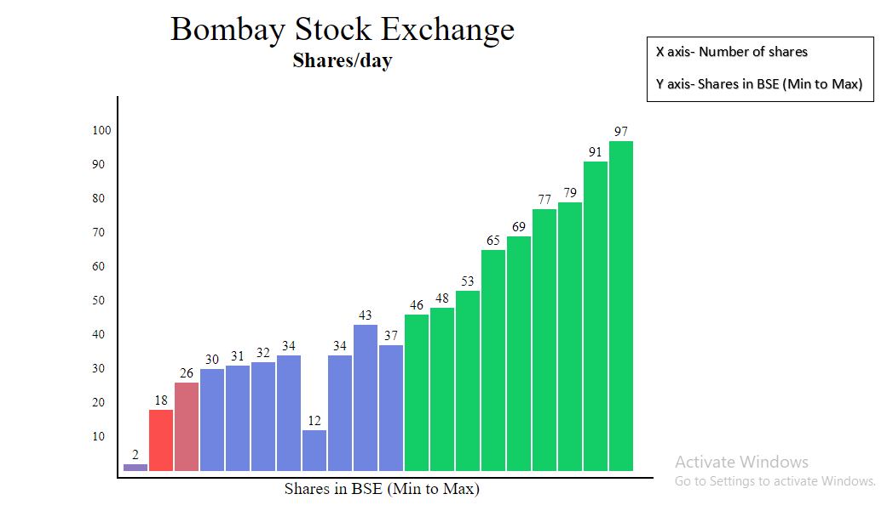
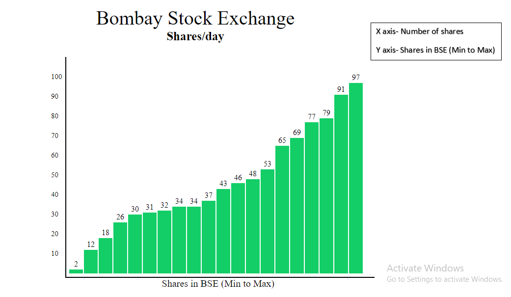

# BarGraph Using Bubble Sort Method
 * Implementing Using HTML, CSS, JS
 * A. What Bubble Sort Does? <i>1. To achieve sorting in Bubble Sort, the adjacent elements in the array are compared and the positions are swapped if the first element is greater than the second. In this fashion, the largest value "bubbles" to the top. 2. Usually, after each iteration the elements furthest to the right are in correct order. The process is repeated until all the elements are in their right position.</i>  

* What Bubble Sort Does?
1. Starting with the first element, compare the current element with the next element of the array.
2. If the current element is greater than the next element of the array, swap them.
3. If the current element is less than the next element, just move to the next element.
4. Start again from Step 1.
  

# Illustrating the Bubble sort method
  

# <h2>Result</h2>
   

